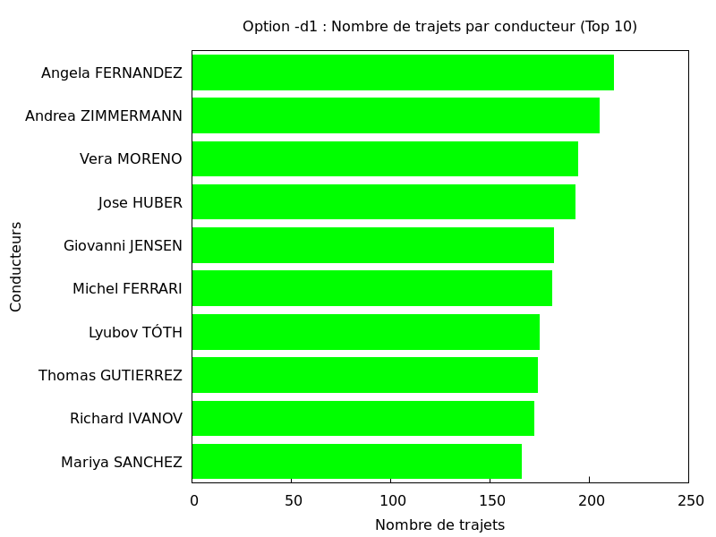
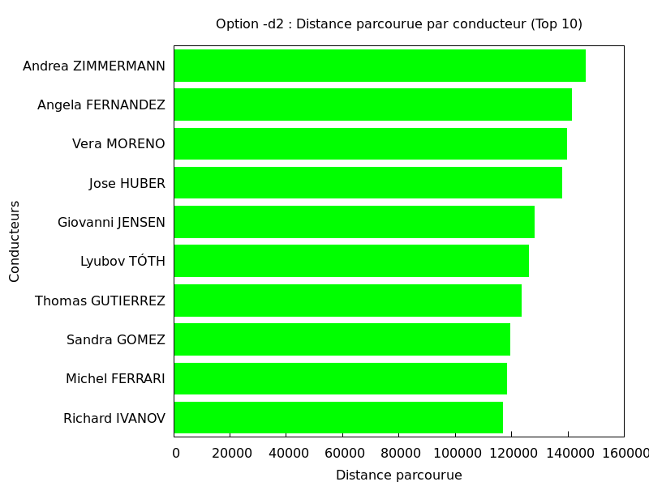
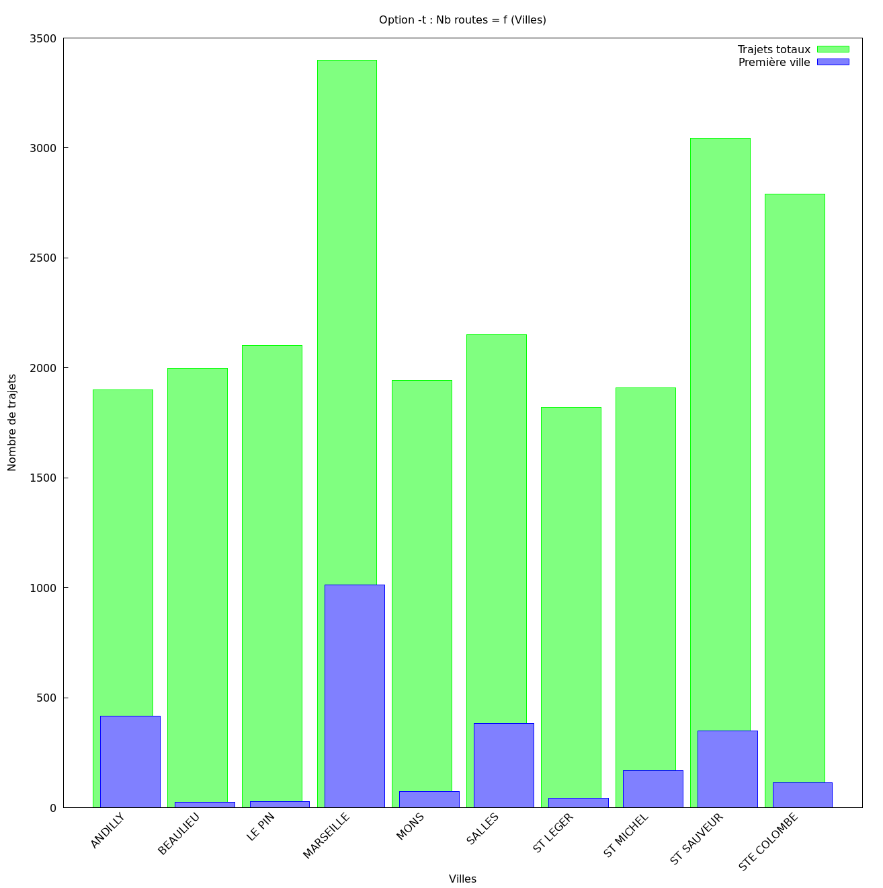
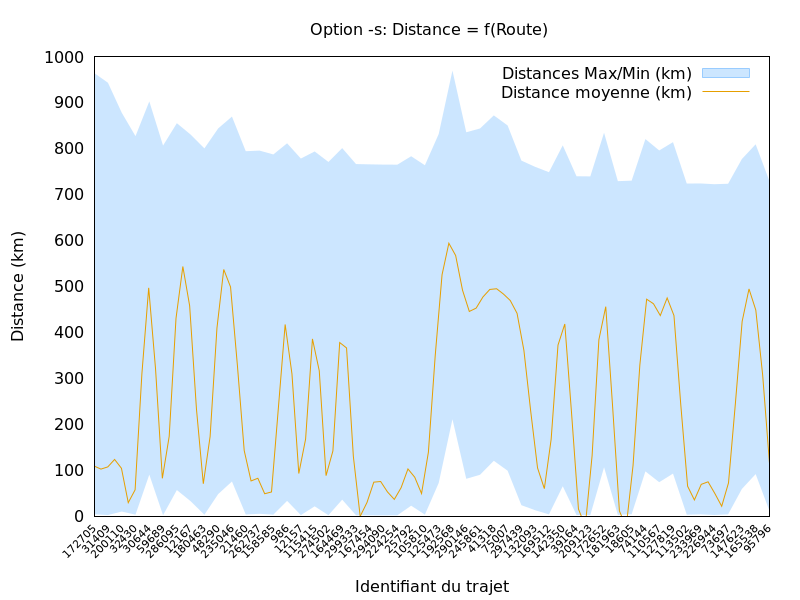

# Présentation du projet

## Répartition des tâches

- Paul P. : scripts Gnuplot pour tous les traitements, traitements D1, D2 et L sous Awk
- Yani A. : lecture du fichier CSV, implémentation AVL, Makefile, script Bash, bonus
- Mathis M. : traitements T et S en C

## Planning de réalisation

### Jalon 1 : Préparation du terrain
- **Programme C**
  - [x] Programme en C basique [YA]
    - [x] Makefile simple
    - [x] Lecture du fichier CSV
    - [x] Implémentation complète et optimisée des arbres AVL (hors suppression)
    - [x] Lecture des arguments et lancement du traitement (avec une implémentation vide)
- **Scripts (Shell, Awk, Gnuplot)**
  - [x] Traitements avec Awk [PP]
    - [x] Traitement D1
    - [x] Traitement D2
    - [x] Traitement L

### Jalon 2 : Les premiers traitements fonctionnels, de la commande jusqu'au graphique
- **Programme C**
  - [x] Traitement D1 en C, avec AVL (bonus, à but d'exemple) [YA]
  - [x] Traitement T en C [MM]
- **Scripts (Shell, Awk, Gnuplot)**
  - [x] Script Bash pour compiler, lancer les traitements, et générer les graphiques [YA]
  - [x] Scripts Gnuplot pour les premiers traitements [PP]
    - [x] Traitement D1
    - [x] Traitement D2
    - [x] Traitement L
    - [x] Traitement T

### Jalon 3 : Un programme complet !
- **Programme C**
    - [x] Traitement S en C [MM]
    - [x] Optimisation de la lecture CSV et meilleure gestion des erreurs (bonus) [YA]
    - [x] Traitement D1 en C, avec table de hachage, expérimental (bonus) [YA]
- **Scripts (Shell, Awk, Gnuplot)**
    - [x] Script Gnuplot pour le traitement S [PP]
    - [x] Compatibilité macOS du script Bash (bonus) [PP & YA]
    - [x] Ajout de l'option `-Q`/`--quick` pour choisir les algorithmes utilisés (bonus) [YA]

### Jalon 4 : Polissage final

- **Programme C**
    - [ ] Vérification entière du code, renforcement de la robustesse et de la gestion d'erreur [YA]
    - [X] Algorithme expérimental pour le traitement T, plus rapide, avec des AVL (bonus) [YA]
- **Scripts (Shell, Awk, Gnuplot)**
    - [ ] Embellissement de l'expérience utilisateur du script Bash (bonus) [?]
      - [X] Messages colorés, avec des emojis
      - [ ] Liens cliquables vers les graphiques et autres fichiers
      - [ ] Vérifications supplémentaires sur les dépendances requises (gnuplot, make)

### Jalon 5 : Toujours plus vite ?! (Bonus, si on a le temps)
- **Programme C**
- [X] Traitements D2 et L en C, avec des AVL et des tables de hachage (pour `-Q1`)  [YA]

### Jalon 6 : BEAUCOUP TROP RAPIDE !! (Bonus, si on a beaucoup de temps)
- **Programme C**
- [ ] Implémentation multi-cœurs des traitements, avec pthreads [YA]

## Limitations

Les arbres AVL ont une hauteur de maximum 64.

## Exemples de commandes et leur résultats

### 1. Lancement du traitement D1
```bash
./PermisC.sh data.csv -d1
```
**Sortie :**
```
Compilation de l'exécutable PermisC... Terminé !
⚙️ | ✅ Traitement D1 en cours... Terminé en 3517 ms !
📈 | Génération des graphiques...
Programme terminé ! Les graphiques sont disponibles dans le dossier « images ».
```
Le résultat est illustré par le graphique suivant (dans le dossier images) :


### 2. Lancement du traitement D2
```bash
./PermisC.sh data.csv -d2
```
**Sortie :**
```
⚙️ | ✅ Traitement D2 en cours... Terminé en 2040 ms !
📈 | Génération des graphiques...
Programme terminé ! Les graphiques sont disponibles dans le dossier « images ».
```

Le graphique généré est le suivant :


### 3. Lancement du traitement L
```bash
./PermisC.sh data.csv -l
```
**Sortie :**
```
⚙️ | ✅ Traitement L en cours... Terminé en 3637 ms !
📈 | Génération des graphiques...
Programme terminé ! Les graphiques sont disponibles dans le dossier « images ».
```

Le graphique généré est le suivant :


### 4. Lancement du traitement T
```bash
./PermisC.sh data.csv -t
```
**Sortie :**
```
⚙️ | ✅ Traitement T en cours... Terminé en 10396 ms !
📈 | Génération des graphiques...
Programme terminé ! Les graphiques sont disponibles dans le dossier « images ».
```

Le graphique généré est le suivant :


### 5. Lancement du traitement S
```bash
./PermisC.sh data.csv -s
```
**Sortie :**
```
⚙️ | ✅ Traitement S en cours... Terminé en 2258 ms !
📈 | Génération des graphiques...
Programme terminé ! Les graphiques sont disponibles dans le dossier « images ».
```

Le graphique généré est le suivant :


### 6. Lancement de tous les traitements avec la vitesse maximale
```bash
./PermisC.sh data.csv -d1 -d2 -l -t -s -Q2
```
**Sortie :**
```
Compilation de l'exécutable PermisC... Terminé !
⚙️ | ✅ Traitement D1 en cours... Terminé en 489 ms !
⚙️ | ✅ Traitement D2 en cours... Terminé en 1166 ms !
⚙️ | ✅ Traitement L en cours... Terminé en 369 ms !
⚙️ | ✅ Traitement T en cours... Terminé en 3529 ms !
⚙️ | ✅ Traitement S en cours... Terminé en 476 ms !
📈 | Génération des graphiques...
Programme terminé ! Les graphiques sont disponibles dans le dossier « images ».
```

Les graphiques générés sont les mêmes que les précédents. (Ils sont toujours dans le dossier « images ».)